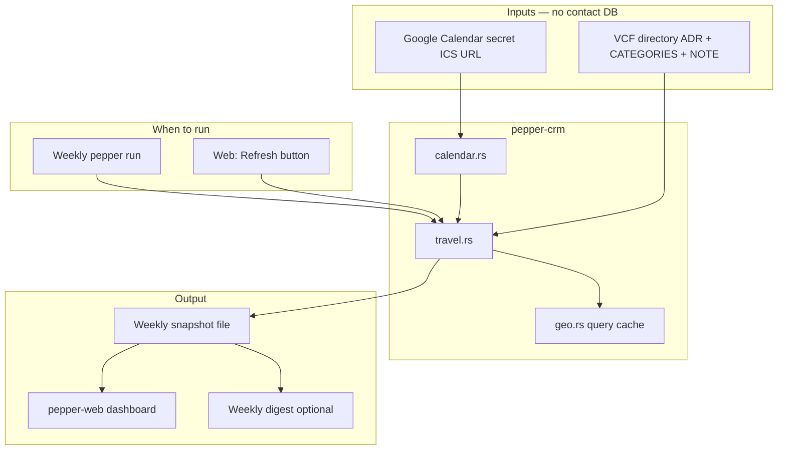

# Next Week Travel — Build Guide

Implementation guide for the **Next Week Travel** dashboard section. Product spec: [`DASHBOARD_SECTIONS.md`](DASHBOARD_SECTIONS.md) §4.

---

## Design principles (non-negotiable)

1. **VCF is the people store.** Contact names, addresses (`ADR`), categories, and `NOTE` tags are read from vCard files at match time. PostgreSQL holds **task state only** (`tasks`, `reconnects`, `digest_log`) — not a copy of contact locations or profile fields.

2. **Weekly list, not a contact database.** The travel feature produces a **computed list for the target calendar week** (trips + suggested people). That list is cached for display until replaced. It is not a permanent contact store.

3. **Refresh cadence.** Rebuild the list **once per calendar week** (scheduled job / first `pepper` run of the week) **or on explicit request** from the web UI (e.g. “Refresh travel matches”). **Do not** auto-refresh on a daily timer, on every page load, or on a background daily cron.

4. **Exclude `Reconnect: Never`.** Never include a contact in travel matches (or, by extension, other “suggest people” surfaces) if their vCard **CATEGORIES** contains `Reconnect: Never`. This is a hard filter applied before geo matching.

5. **`Reconnect:` lives in CATEGORIES.** Reconnect scheduling and trip triggers (`Reconnect: 3 months`, `Reconnect: before Chicago trip`, `Reconnect: Never`, etc.) are stored as **category values** on the vCard, not in `NOTE`. The `NOTE` field remains for freeform notes, `TODO:` lines, and the CRM log. Legacy `Reconnect:` lines in `NOTE` may still be read as a fallback until contacts are migrated.

6. **Assistive, not automatic.** Surfacing someone on the list does not write to VCF. Any write-back (log interaction, new tags) stays explicit and user-driven.

---

## What the feature does

For **next calendar week** (configurable week boundary, default Mon–Sun):

1. Read **your** travel from Google Calendar (private ICS link).
2. Read **contacts** from the local VCF directory (`ADR` for geo; **`CATEGORIES`** for `Reconnect:` tags including trip triggers).
3. **Geocode** place names (trip title + contact cities) with a query cache — not per-contact DB rows.
4. **Match** contacts within a metro radius (~50 km / ~30 mi default).
5. **Rank** matches: trip-tag boost → distance → (future: time since last CRM log).
6. **Save** one weekly snapshot and show it on the dashboard / digest until replaced.

### Example output

```
Next Week Travel: Chicago, IL (May 26–29)
  3 people in the Chicago metro you could meet:
    · James Martinez — Evanston (~15 mi) · tagged "before Chicago trip"
    · Sofia Chen — Chicago
  [Draft outreach]  [View on map]
```

---

## Data flow



---

## Calendar input (Google, private link)

**Source:** Google Calendar → Settings → Integrate calendar → **Secret address in iCal format**.

**Env:** `GOOGLE_CALENDAR_ICS_URL` (treat as a secret; do not commit).

**Convention (this user’s setup):**

- Multi-day events spanning travel dates.
- **Event title (`SUMMARY`) = destination** (e.g. `Chicago, IL`, `Denver`). No need to parse `LOCATION` for v1.

**Implementation:**

- HTTP GET the ICS URL when a build is triggered (not on every dashboard view).
- Select events overlapping **next week** (`DTSTART` / `DTEND`).
- Emit `TravelTrip { title, start_date, end_date }` per event.

**Later:** OAuth or additional calendars — same `TravelTrip` type, different adapter.

---

## Reconnect tags in `CATEGORIES`

In this project, **`Reconnect: …` is a vCard category**, not a `NOTE` line. Each category value uses the `Reconnect: ` prefix followed by the tag body.

| Category value | Meaning |
|----------------|---------|
| `Reconnect: 3 months` | Timed follow-up (synced to Postgres `reconnects` on VCF sync) |
| `Reconnect: before Chicago trip` | Deferred — boost when Chicago trip detected |
| `Reconnect: Never` | **Exclude** from travel matches and random-person picks |

**VCF examples:**

```vcf
CATEGORIES:Reconnect: 3 months
```

```vcf
CATEGORIES:Reconnect: before Chicago trip
```

```vcf
CATEGORIES:Reconnect: Never
```

Multiple categories (comma-separated) are allowed; only one `Reconnect:` category should be active — **last `Reconnect:` category wins** (same rule as today’s last `Reconnect:` line in `NOTE`).

**Parser work required:**

- `vcard.rs`: parse `CATEGORIES` (and `CATEGORY` if present) into `categories: Vec<String>`.
- `tags.rs`: add `parse_reconnect_category(categories: &[String]) -> Option<String>` — strip `Reconnect: ` prefix, return body (e.g. `3 months`, `before Chicago trip`, `Never`).
- `Contact.reconnect_tag`: populate from **categories first**, then fall back to `NOTE` for legacy test VCFs.
- Helpers: `is_reconnect_never()`, `is_city_trigger()` — operate on the resolved reconnect body.

**TODO tags** stay in `NOTE` for now (`TODO: …` lines). Only `Reconnect:` moves to categories.

---

## Contact input (VCF only)

On each **build** (not on every page view):

1. `parse_vcards_from_dir(CONTACTS_DIR)`.
2. For each contact:
   - Resolve **reconnect** from `CATEGORIES` (fallback: `NOTE`).
   - **Filter out** if reconnect body is `Never` (category `Reconnect: Never`).
   - Use **`ADR`** for city (and state/country when present) for geocoding query string, e.g. `"Evanston, IL"`.
   - Use reconnect body `before [city] trip` (`is_city_trigger`) for **ranking boost** when city fuzzy-matches the trip title.

---

## Geocoding

- **Not stored on contacts.** Geocode the trip title and each contact’s address string at build time.
- **Query cache only** (file or small `geocode_cache` table): normalized query → `(lat, lng, fetched_at)`. TTL ~7 days per [`DASHBOARD_SECTIONS.md`](DASHBOARD_SECTIONS.md).
- Default provider: **Nominatim** (OpenStreetMap) with `User-Agent` and ~1 req/s rate limit.
- **Env:** `GEOCODER=nominatim`, `NOMINATIM_USER_AGENT`, `METRO_RADIUS_KM=50`, `GEOCODE_CACHE_TTL_DAYS=7`.

**Matching:** Haversine distance from trip center to contact ≤ `METRO_RADIUS_KM`.

**Spec test cases** (from product doc):

| Trip center | Contact city | Match? |
|-------------|--------------|--------|
| Chicago, IL | Chicago, IL | Yes |
| Chicago, IL | Evanston, IL | Yes (~20 mi) |
| Chicago, IL | Littleton, CO | No |
| Denver, CO | Littleton, CO | Yes |
| Denver, CO | Boulder, CO | Yes |

---

## Ranking

For each `TravelTrip`, sort candidates:

1. **Trip tag boost** — `Reconnect: before … trip` in **CATEGORIES** (or legacy `NOTE`) and city fuzzy-matches trip title.
2. **Distance** — ascending km.
3. **Recency** (future) — last CRM log date from `NOTE` / `--- CRM Log ---`.

---

## Weekly snapshot (the only travel persistence)

**Path (recommended v1):** `.cache/travel/{iso_week}.json`  
Example: `.cache/travel/2026-W21.json`

**Contents (JSON schema sketch):**

```json
{
  "week_start": "2026-05-18",
  "week_end": "2026-05-24",
  "built_at": "2026-05-18T09:00:00Z",
  "trips": [
    {
      "title": "Chicago, IL",
      "start": "2026-05-26",
      "end": "2026-05-29",
      "matches": [
        {
          "uid": "...",
          "full_name": "James Martinez",
          "city": "Evanston",
          "distance_km": 24.1,
          "reason": "tagged_before_trip"
        }
      ]
    }
  ]
}
```

**Rules:**

- One file per **target week** (the week being shown as “next week”).
- **Replace** the file when a build runs for that week again.
- **Do not** auto-rebuild when serving the dashboard; read the snapshot if present and fresh for that week.
- Old week files may be deleted or left on disk; UI only reads the current target week’s file.

Add `.cache/` to `.gitignore` if not already ignored.

---

## When to run a build

| Trigger | Behavior |
|---------|----------|
| **Weekly** | `pepper` runner (or dedicated `pepper travel-build`) once per week builds snapshot if missing or `force` not needed |
| **Web request** | `POST /travel/refresh` (or similar) runs full build, overwrites snapshot, redirects back to dashboard |
| **Dashboard GET** | Load snapshot only; **no** geocoding, **no** ICS fetch |
| **Daily cron** | **Not used** |

**Staleness:** If snapshot `week_start` does not match computed “next week”, treat as missing and show empty state + “Refresh” until user or weekly job builds.

---

## PostgreSQL

**Do not** add contact location columns for this feature.

Optional (task state only, already exists):

- `reconnects` with `status = 'deferred'` for `before … trip` tags synced from VCF during task sync — useful for digest/reconnects, **not** required for travel geo (travel reads VCF at build time). When implementing categories, **VCF sync** (`upsert_contacts_batch`) must read reconnect from `CATEGORIES` (same resolved `reconnect_tag` as travel), not only from `NOTE`.

Optional (not contacts):

- `geocode_cache` table **or** file cache under `.cache/geocode/` — place-name queries only.

---

## Module layout (`pepper-crm`)

| Module | Responsibility |
|--------|----------------|
| `vcard.rs` | Parse `CATEGORIES`; set `reconnect_tag` from categories |
| `tags.rs` | `parse_reconnect_category()`, `is_reconnect_never()`; keep `NOTE` fallback |
| `calendar.rs` | Fetch ICS URL; parse events; `get_travel_trips_next_week()` |
| `geo.rs` | `geocode_cached()`, `haversine_km()`, radius check |
| `travel.rs` | `build_travel_week()`, filter Never, match, rank, write snapshot |
| `travel_cache.rs` (optional) | Read/write `.cache/travel/{week}.json` |

**Public API** (export from `lib.rs` when implemented):

- `build_travel_week_snapshot(...) -> TravelWeekSnapshot`
- `load_travel_week_snapshot(week) -> Option<TravelWeekSnapshot>`
- `is_reconnect_never(contact: &Contact) -> bool`

---

## MCP servers (thin wrappers)

| Server | Tool | Notes |
|--------|------|-------|
| **mcp-calendar-server** (new) | `get_upcoming_travel` | ICS URL → trips |
| **mcp-vcard-server** (existing) | `parse_vcards` | Ensure `categories` in summary |
| **mcp-travel-server** (new) or scheduler extension | `build_travel_week`, `get_travel_week` | Build + read snapshot |
| **mcp-digest-server** (later) | extend `render_digest` | Optional travel section |

`pepper` weekly run: after `get_due`, call `build_travel_week` unless snapshot already exists for target week (skip unless `--force-travel`).

---

## Web dashboard (`pepper-web`)

1. **GET /** — Load snapshot for next ISO week; render travel section from JSON (no mock data when snapshot exists).
2. **POST /travel/refresh** — Run `build_travel_week_snapshot`, save file, redirect to `/`.
3. Show **last built** timestamp and week range.
4. Summary stat **Travel matches** = total matches across trips in snapshot.
5. Empty state: no ICS URL configured / no trips / no matches / snapshot stale.

---

## Configuration (`.env.example`)

```bash
# Google Calendar — secret iCal URL (event title = destination)
GOOGLE_CALENDAR_ICS_URL=https://calendar.google.com/calendar/ical/.../basic.ics

CONTACTS_DIR=./contacts

# Geocoding
GEOCODER=nominatim
NOMINATIM_USER_AGENT=pepper-crm/1.0 (you@example.com)
METRO_RADIUS_KM=50
GEOCODE_CACHE_TTL_DAYS=7

# Optional: override next week for dev/testing
# TRAVEL_WEEK_OVERRIDE=2026-W21
```

---

## Implementation phases

### Phase 1 — VCF categories + travel core

- [x] Parse `CATEGORIES` in `vcard.rs`; `parse_reconnect_category()` in `tags.rs`; `is_reconnect_never()`; `NOTE` fallback for legacy VCFs
- [x] `calendar.rs`: fetch Google ICS, trips next week, title = destination
- [x] `geo.rs`: geocode cache + haversine
- [x] `travel.rs`: filter Never → match → rank
- [x] Unit tests: Never excluded; spec distance table; ICS fixture

### Phase 2 — Weekly snapshot + cache

- [x] `travel_cache.rs`: write/read `.cache/travel/{week}.json`
- [x] `build_travel_week_snapshot()` orchestration
- [x] `.gitignore` for `.cache/`

### Phase 3 — Web UI

- [x] Dashboard reads snapshot only on GET
- [x] `POST /travel/refresh` for on-demand build
- [x] Replace mock section in `dashboard.html`
- [x] Travel matches stat

### Phase 4 — MCP + weekly runner

- [x] `mcp-calendar-server`, `mcp-travel-server` (sources added; build with rest of MCP workspace when `rmcp` Server API is aligned)
- [x] `pepper` calls build once per week; `--force-travel` flag (via `pepper-crm` library)

### Phase 5 — Digest + actions (optional)

- [ ] Travel block in `templates/digest.html`
- [ ] `mailto:` draft, map link, dinner `.ics` via `mcp-cal-server`

### Phase 6 — Later

- [ ] Google OAuth (if secret ICS link retired)
- [ ] CRM log recency in ranking
- [ ] Metro alias / polygon data

---

## Testing checklist

- [ ] Contact with `CATEGORIES:Reconnect: Never` never appears in matches
- [ ] Contact with `CATEGORIES:Reconnect: before Chicago trip` ranks above same-distance contact without tag
- [ ] Legacy `Reconnect: before Chicago trip` in `NOTE` still works via fallback
- [ ] Chicago / Evanston in; Chicago / Littleton out
- [ ] Snapshot not rebuilt on dashboard GET
- [ ] POST refresh rebuilds and updates `built_at`
- [ ] Weekly run skips rebuild if snapshot exists for target week (unless forced)
- [ ] Missing `GOOGLE_CALENDAR_ICS_URL` → clear error in UI

---

## Related docs

- Product spec: [`DASHBOARD_SECTIONS.md`](DASHBOARD_SECTIONS.md) §4
- Architecture: [`personal_crm_design.md`](personal_crm_design.md) — VCF people store, DB task state
- Dashboard mock: `pepper-web/templates/dashboard.html`

---

## Open decisions (defaults chosen above)

| Question | Default in this guide |
|----------|-------------------------|
| Where is weekly list stored? | `.cache/travel/{iso_week}.json` |
| Contact geo in Postgres? | **No** |
| Calendar auth v1? | Secret ICS URL only |
| Refresh on page load? | **No** — snapshot or manual refresh |
| Where do `Reconnect:` tags live? | **`CATEGORIES`** (primary); `NOTE` legacy fallback |
| `Reconnect: Never`? | Category `Reconnect: Never` — hard exclude |
